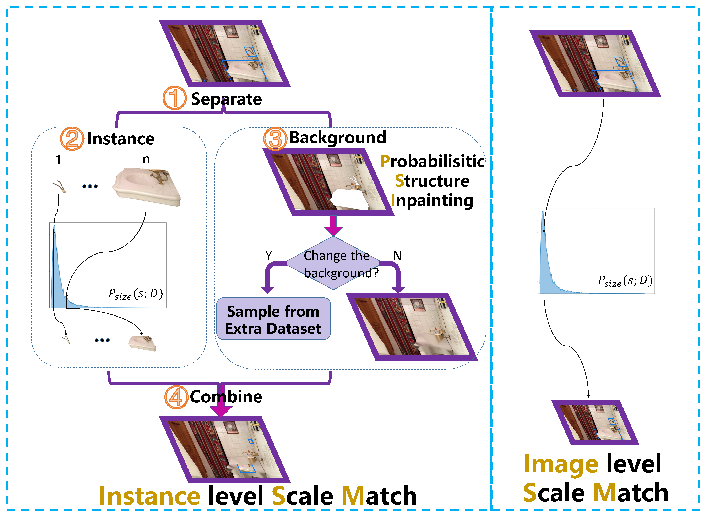

# Instance-level Scale Match (SM+)

------------------------
## Introduction
we investigate the scale alignment between pre-training and target datasets, and propose a new refined Scale Match method (termed SM+) for tiny person detection. SM+ improves the scale match from image level to instance level, and effectively promotes the similarity between pre-training dataset and target dataset.

## Illustration of the difference between SM and SM+

While SM only considers the whole image, our SM+ focuses on every instance. The instance-level approach achieves scale match in a finer level. Our SM+ mainly consists of four steps: (1) Separation, (2) Instance processing, (3) Background processing, and (4) Combination.

## Visualization

Background based on inpainting (\textbf{top}) vs. Background based on new sampling (\textbf{bottom}). The inpainting method might not repair some artifacts, but changing the background does not cause this problem.

## Coming Soon!!
